# Fiat 500e Charge Port Replacement
## How I replaced a broken charge port on 2015 Fiat 500e
May 23, 2021

Sometime into our ownership of a used 500e, the charge port became loose when connecting the charge cable.  Upon closer inspection, we could see where it had been previously broken and glued.  That repair failed.  Looking at 500e forum, it was clear that dealership repair was outrageously expensive but that there was a fairly straightforward DIY fix.  Fortunately, the repair does not require any major change to the electrical lines.  It is just removing the current electrical pins from the broken plastic port housing and placing them in a new plastic port housing.

A search on eBay for a replacement charge port yielded a hit for a port with instructions that matched the process mentioned as successful in the forum.  I'm documenting it for my personal future reference.  The whole job took a few hours with me taking my time, some breaks, and taking photos.

If you choose to follow, your actions are your own.  I can not be held responsible for any errors nor the outcomes of your actions.  You assume all the risks associated with automotive and electrical repair.

## Process
The process I used followed the instructions supplied with the new port.  They were detailed and complete but contained no drawings or images for guidance.  I'm documenting my process here for better reference (when I have to do it again)

### Prep and Access
- Disconnect 12V battery
- Set parking brake and chock driver rear wheel
- Pop hubcap cover on passenger rear wheel
- Loosen lug bolts (17mm)
- Jack car
  - Borrowed scissor jack from my Mazda
    - Located it surrounding pinch weld in the rear.  It barely clears the fat weld and I had to avoid bent areas from someone else's previous poor attempt
  - Lumber stack under shock mount for safety stand
  - 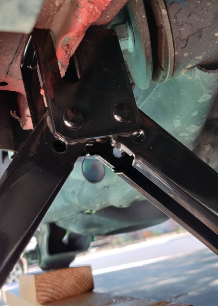
- Remove bolts and wheel
  - Lowered jack slightly to place partial weight onto lumber stack to avoid potential drops
- Remove fender well cover attachments
  - 3 plastic nuts on center interior side
  - 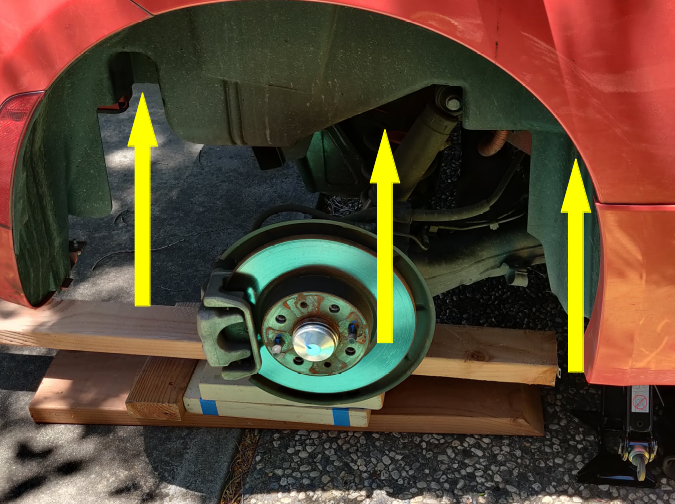
  - 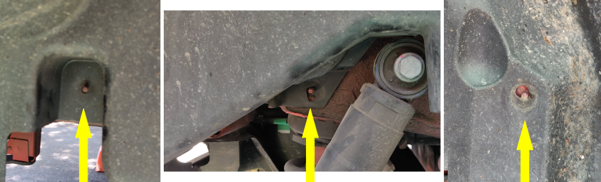
  - 3 screws on rear exterior side
  - 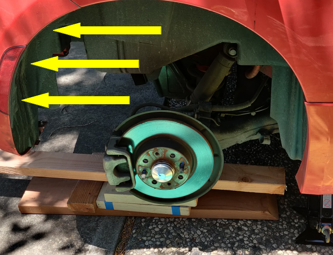
  - 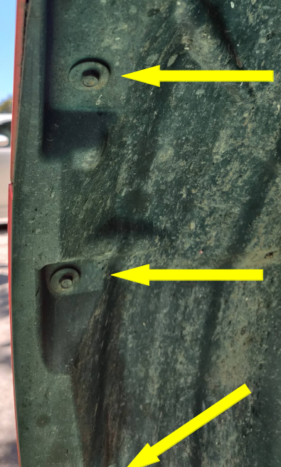
- Remove fender well cover
  - Disconnect rear catch
  - 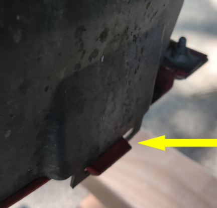
  - Pull interior side off rear-most stud, then center stud
  - Pull exterior side from under fender lip working from rear forward until it became too hard
  - Pull interior side off front-most stud.  This took some work.
  - Pull remaining exterior side from under fender lip.  This also took some work and pulling, but it eventually popped loose
  - Remove fender well cover from the wheel area which exposes the electrical leads and port
  - 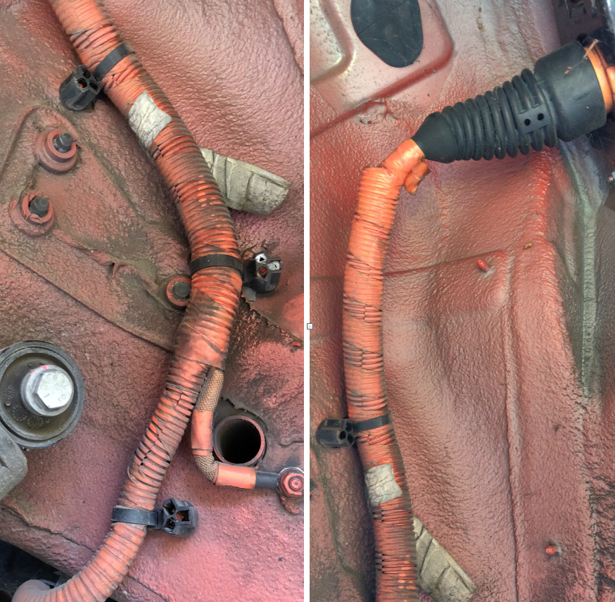

### Port Removal
- Remove plastic port surround
  - Use plastic pry tool to avoid scratching paint.  There are two connecting tabs on the backside to the left and the right of the center hole
  - 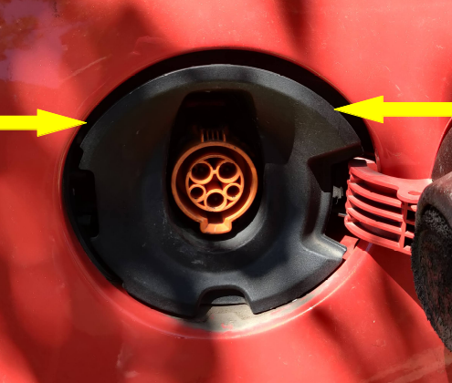
- Remove 4 nuts from outside attachment plate
  - 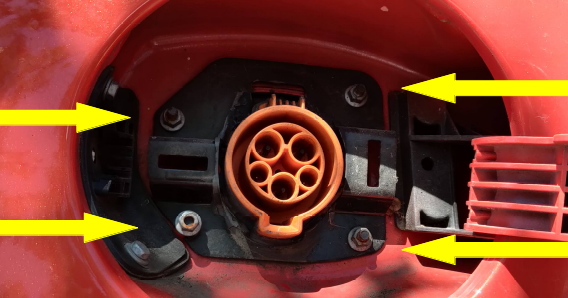
- Remove outside attachment plate
  - This took some prying on ours because of glue buildup from previous repair
- Push port through hole into fender well
- Pry plastic binding post away that connects port to inside attachment plate
  - 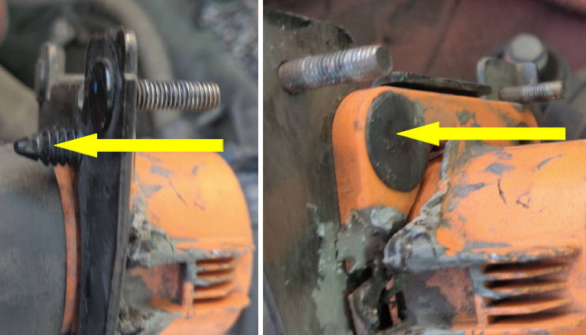
- Slide inside attachment plate down and off electrical cable
  - 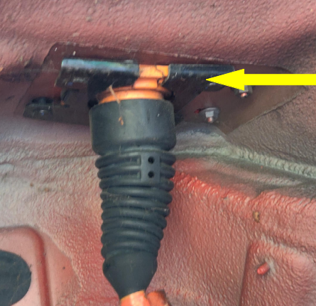
- If not already, now is a good time to be wearing rubber insulated gloves to protect you from the wiring, and the wiring from you. (Safety and cleanliness)
- Slide rubber boot down the cabling to reveal the locking clip
  - 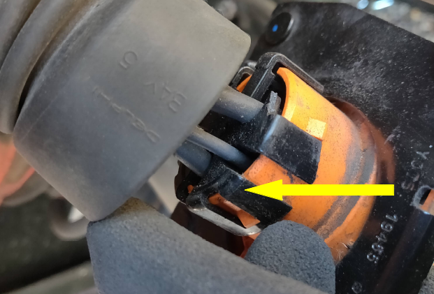
  - This is a good time to inspect the cabling layout into the port and photograph the layout to help if something goes wrong. There are 3 longer, larger pins that are power pins (L1, L2(240V) or N(120V), and GND) arranged in an inverted triangular configuration, and 2 shorter, smaller pins tucked to either side of the triangle that are  signaling pins to indicate connection parameters.  We will carefully transfer each pin to its exact location in the new port.  [Reference -> [Wikipedia SAE J1772](https://en.wikipedia.org/wiki/SAE_J1772)]
  - 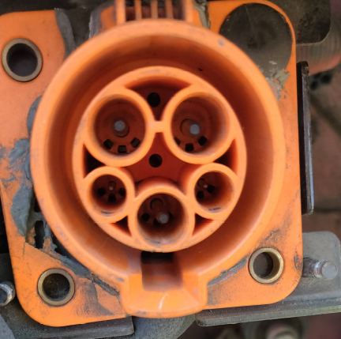
- Have the new locking clip within easy reach at this point
- Use screwdriver to lift each locking tab over its catch until the locking clip is released.
  - Procede with great care from this point forward
  - A couple of locking tabs broke while releasing them showing how important it is to replace the locking clip as well as the port
- Slowly slide the locking clip off the port making sure the pins come with it and maintain their positions within the clip.  Don't let them fall out and lose the wiring order.  Even with photos its hard to identify each cable correctly.
  - 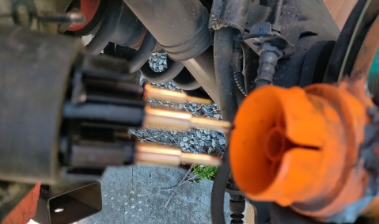
  - 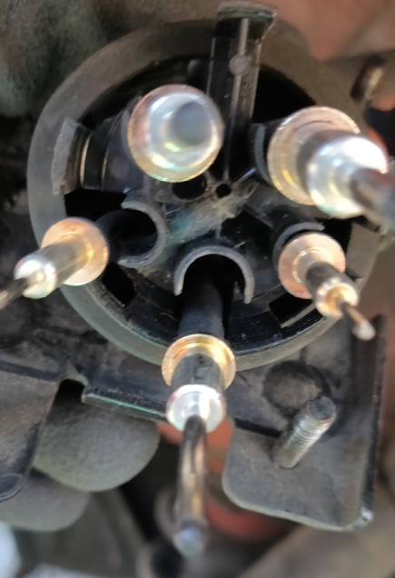

### Port Installation
- Take the new locking clip and exactly mimic the orientation next to the old clip
- Carefully transfer one pin at a time from the old locking clip to the new locking clip making sure each pin position is unchanged in the new locking clip
- After all pins are transferred to the new locking clip, slide the new pins into their associated holes in the new port
- Slide the locking clip up over the new port until it fully locks and all of the pins are properly seated
- Slide the rubber boot up the cabling, over the locking clip until it is fully seated on the new port
- Slide the inside attachment onto the cable making sure it's orientation will allow it to fit the fender mounting holes
- Mate the inside attachment plate with the new port and secure with the plastic binding post
  - 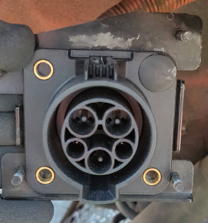
- Press the port assembly through the fender hole with the binding posts through their associated holes
  - 
- Place the outside attachment plate over the port and binding posts, then secure with 4 nuts
  - 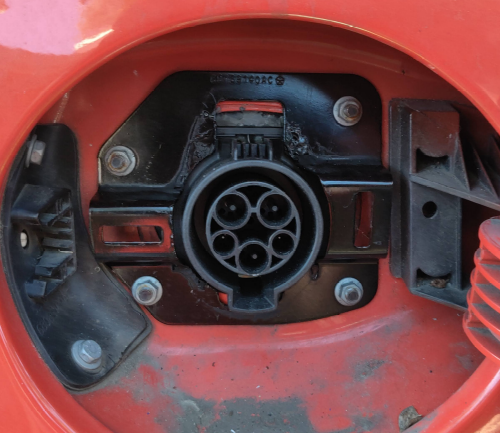

### Test
- Reconnect 12V battery
- Plug charging cable into port and verify that charging starts properly
  - If it doesn't then the cable order was likely messed up or some pin was badly contaminated.  Since I didn't suffer this fate, I can't really help provide correcting suggestions other than inspect for cleanliness and compare your assembly to your photos to see if you can identify the error
- Disconnect charging cable

### Re-assembly
- Press plastic port surround back into place until it locks in.  It's mounting tabs only allow the proper orientation
  - 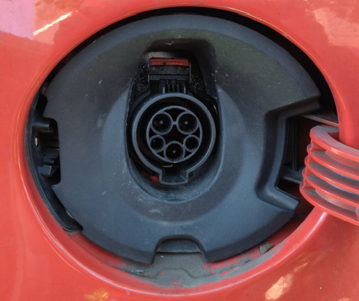
- Place the plastic fender well with the wheel area
- This is what worked for me install the fender well
  - Place well onto front binding post first, without bothering to get the well underneath the front lips
  - Carefully press the front of the well into the wheel area until is snaps past the front lips.  This will take some pressure
  - Locate the well over the center then rear binding posts
  - Press the upper portion of the well until is snaps under the fender lip
  - The rear portion of the well remains outside of the fender lip, so don't try to snap it into the lip.  There's a notch in the well at the transition area where the well moves from the inside of the lip to the outside
  - Snap bottom of well into its retaining clip on the bottom of the fender
  - Re-install 3 mounting screws on rear of fender well
  - Re-install 3 plastic mounting nuts onto binding posts protruding through fender well
- Raise jack slightly to remove safety support
- Install rear wheel and lug bolts snugly
- Lower jack and remove
- Torque lug bolts evenly (80 ft-lbs)
- Remove wheel chocks and done!

## Failure Analysis
This failure reveals the weakness of the charging port.  If excessive force is applied to the charging cable, the stress can overcome the strength of the charging port in the vehicle and snap the housing.  Excessive forces are most likely applied by bumping the charging handle or tripping over the charging cable.  Anyone can potentially do this either accidentally or purposefully.  So I suspect this problem will eventually repeat itself.
  - 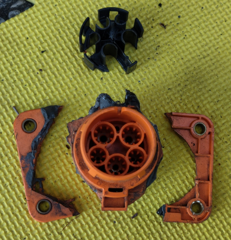
